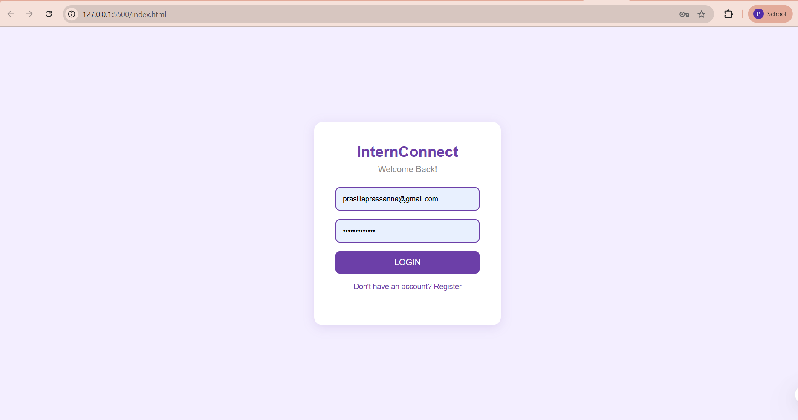
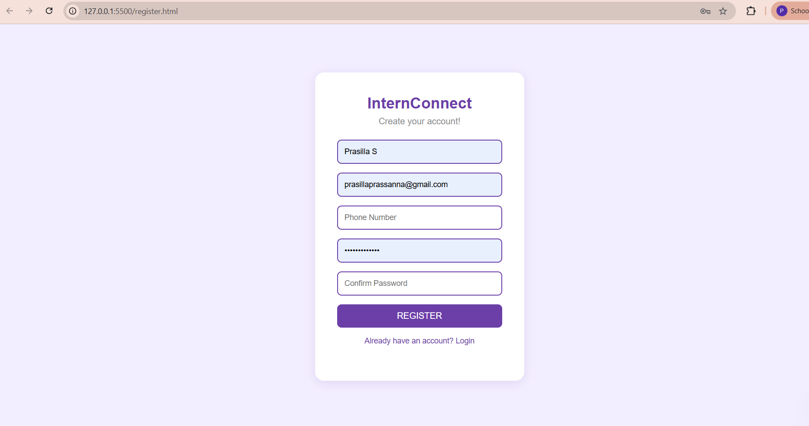
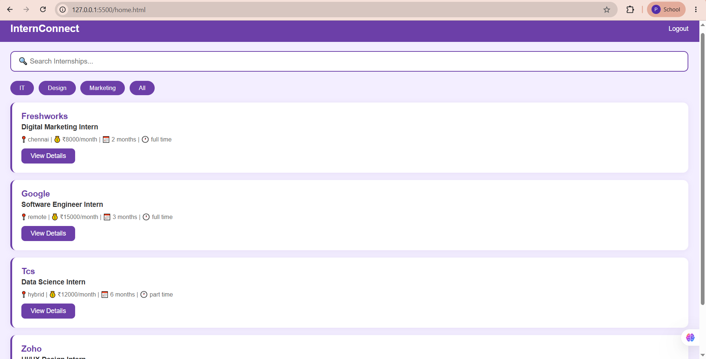
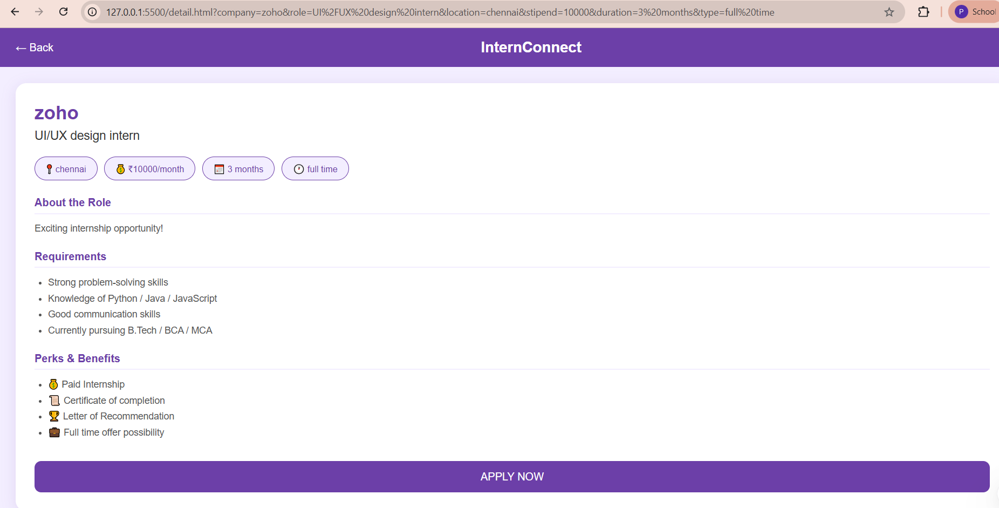
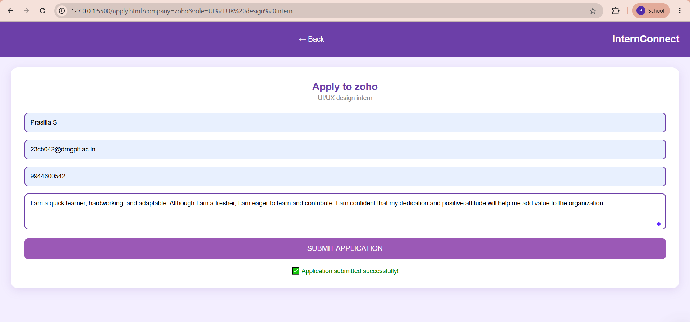

# InternConnect – Internship Finder Web App

InternConnect is a full-stack internship discovery platform that helps students search, filter, and apply for internships through a clean, easy-to-use interface. The project covers the complete product cycle — from UX research and Figma prototyping to a working web application backed by Firebase.

## 🎯 Project Overview

- Designed end-to-end UX in Figma: user personas, user flows, wireframes, and an interactive prototype
- Built a fully functional web app using HTML, CSS, and JavaScript
- Integrated Firebase Authentication for secure login and registration
- Used Cloud Firestore as a real-time database for internship listings and applications
- Implemented live search and category filtering across internship listings

## 🛠️ Tech Stack

- **Design:** Figma (UX research, wireframes, prototyping)
- **Frontend:** HTML, CSS, JavaScript
- **Backend:** Firebase Authentication, Cloud Firestore
- **Hosting (local dev):** Live Server

## 📱 Screens

### Login Page

### Register Page

### Home Page – Search & Filter Internships

### Internship Detail Page

### Apply Page

## ✨ Features

- 🔐 Secure user registration and login with Firebase Authentication
- 🔍 Real-time search across internship listings
- 🏷️ Category-based filtering (IT, Design, Marketing)
- 📄 Detailed internship view with role, stipend, duration, and requirements
- 📝 Application form with data saved live to Firestore
- 🎨 Clean, purple-themed UI designed in Figma before development

## 🚀 How It Works

1. User registers or logs in (Firebase Authentication)
2. Home page fetches internship listings live from Firestore
3. User searches or filters listings by category
4. Clicking an internship opens a detail page with full information
5. User submits an application, which is stored in Firestore in real time

## 👩‍💻 Author

**Prasilla S**  
B.Tech CSBS, DR. NGP Institute of Technology  
[LinkedIn](https://www.linkedin.com/in/prasilla-s-68b34b351) | [Email](mailto:prasillaprassanna@gmail.com)
